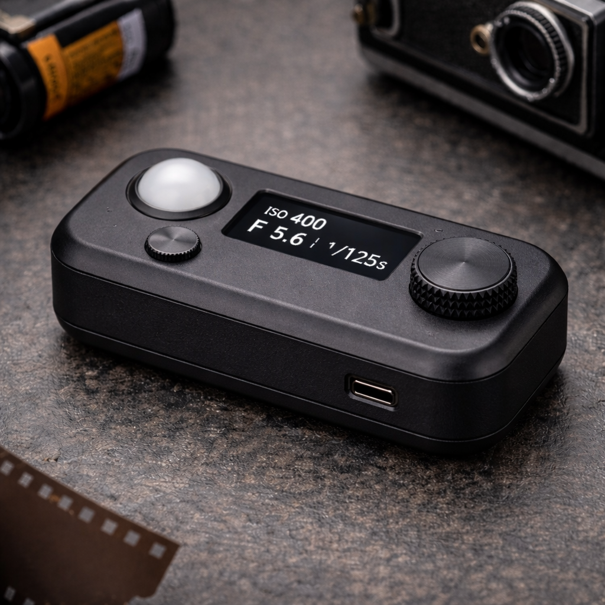
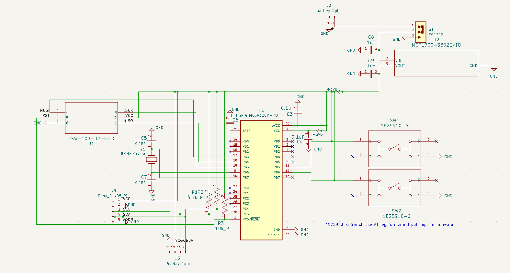

# Lux2ISO — Film Light Meter

A battery-powered, handheld light meter for film photographers. Measures ambient light with a digital sensor and recommends the appropriate film ISO for a given aperture and shutter speed combination.

Designed from scratch as a complete end-to-end hardware project: custom schematic, custom PCB layout, and original firmware.

---



---
## Features

- Measures ambient light in lux using a BH1750 digital sensor (I2C)
- Calculates recommended ISO using the exposure equation
- Displays lux reading, aperture, shutter speed, ISO, and light condition label on a 128×64 OLED
- Battery powered via MCP1700 3.3V LDO regulator
- Power switch with reverse-polarity protection diode
- ICSP header for in-circuit programming
- Two tactile buttons for user input (future firmware use)

---

## Hardware

### Schematic Design Notes

- The ATmega328P runs at **8MHz** to comply with the 3.3V operating voltage limit (the datasheet maximum clock at 3.3V is ~10MHz; 16MHz requires ≥4.5V)
- The 27pF crystal load caps are calculated to match the Citizen HC-49-U-S crystal's 18pF load spec: $C_L = C/2 + C_{stray} \approx 13.5 + 4.5 = 18\text{pF}$
- The MCP1700 requires **1µF on both VIN and VOUT** for LDO loop stability — these are placed adjacent to the regulator on the PCB
- I2C pull-up resistors R1/R2 (4.7kΩ) are on the SDA and SCL lines for the BH1750 sensor and OLED display
- SW1/SW2 use the ATmega's internal pull-ups in firmware — no external pull resistors required
- AREF (pin 21) is bypassed to GND with a 100nF cap per datasheet recommendation



### Components

| Reference | Part | Description |
|---|---|---|
| U1 | ATmega328P-PU | 8-bit AVR microcontroller, DIP-28 |
| U2 | MCP1700-3302E/TO | 3.3V LDO voltage regulator, TO-92 |
| Y1 | HC-49-U-S8000000ABJB | 8MHz crystal, HC-49/US, 18pF load |
| J5 | Conn_01x05 | BH1750 light sensor module connector |
| J3 | Conn_01x04 | SSD1306 OLED display connector |
| J1 | TSW-103-07-G-D | 6-pin ICSP programming header |
| J2 | Conn_01x02 | Battery connector |
| S1 | EG1218 | SPDT power switch |
| SW1, SW2 | 1825910-6 | Tactile pushbuttons |
| R1, R2 | 4.7kΩ | I2C pull-up resistors |
| R3 | 10kΩ | RESET pull-up resistor |
| C1, C2 | 27pF | Crystal load capacitors (C0G) |
| C3, C4 | 0.1µF | ATmega AVCC/VCC decoupling |
| C6 | 0.1µF | AREF decoupling cap |
| C8, C9 | 1µF | MCP1700 VIN/VOUT bypass caps |

---

## PCB Design

Designed in **KiCad 10**. Two-layer board with:
- Signal and power traces on **F.Cu** (front)
- Full **GND copper pour** on **B.Cu** (back)
- Through-hole construction throughout for hand solderability
- 1mm power traces, 0.5mm signal traces
- 1.6mm via diameter, 0.8mm via hole

### Design Decisions
- All components are through-hole for ease of hand assembly and rework
- Decoupling capacitors placed as close as possible to ATmega VCC (pin 7), AVCC (pin 20), and AREF (pin 21)
- Crystal and its load caps are placed directly adjacent to ATmega pins 9/10 with short traces to minimize parasitic capacitance
- MCP1700 bypass caps placed immediately adjacent to the regulator pins

---

## Firmware

Written in Arduino C++ (`firmware/main/main.ino`). Uses the following libraries:

- `BH1750` — reads lux from the light sensor over I2C
- `Adafruit_SSD1306` + `Adafruit_GFX` — drives the OLED display
- `Wire` — I2C communication

The display refreshes every 500ms and shows:
- Live lux reading
- Aperture and shutter speed used for calculation
- Recommended ISO (snapped to nearest standard film speed)
- Scene label (e.g. "Bright Outdoors", "Indoor Dim")

### Flashing

The ATmega328P must be fused for **external full-swing crystal oscillator** before use. Default factory fuses use the internal 8MHz RC oscillator and will not drive Y1.

Flash using the ICSP header (J1) with an Arduino as ISP or a USBtinyISP programmer:

```bash
# Set fuses for external crystal (8MHz full-swing)
avrdude -p m328p -c usbtiny -U lfuse:w:0xE7:m -U hfuse:w:0xD9:m -U efuse:w:0xFF:m

# Upload firmware via Arduino IDE
# Board: "Arduino Pro or Pro Mini" | Processor: "ATmega328P (3.3V, 8MHz)"
```

---

## Repository Structure

```
Lux2ISO/
├── firmware/
│   └── main/
│       └── main.ino        # Arduino firmware
├── docs/
│   └── exposure-math.md    # Exposure equation derivation
├── PartsList.md             # DigiKey/Amazon links for all components
└── README.md
```

---

## Future Improvements

- Rotary encoder for user-selectable aperture and shutter speed
- Reflected vs. incident metering modes
- Non-volatile memory to save last-used settings
- Pocket-sized 3D printed enclosure
- Low battery indicator

